# Лабораторная работа 2. Sortings

## Структура проекта

- `source/`  — исходники программ и реализаций сортировок.
- `include/` — публичные заголовки.
- `common/`  — общие утилиты, assert'ы и logger.
- `scripts/` — генерация тестов, запуск точек, построение графиков.
- `python/plot_results.py` — генерация PNG-графиков из CSV.
- `results/csv/`           — результаты замеров.
- `results/plots/`         — графики.

## Сборка

```bash
make all
```

мини-тест:

```bash
make check
```

## Полный запуск

Генерация тестов:

```bash
./scripts/generate_tests.sh ./tests 2147483647 42 all
```

Полный прогон всех точек:

```bash
./scripts/run_all_points.sh ./tests ./results
```

Построение всех графиков:

```bash
./scripts/plot_results.sh all ./results/csv ./results/plots
```

## Конфигурация тестов

Параметры берутся из `scripts/common.sh`.

- `small_tests`: `n = 0..1000`, шаг `50`, `5` копий.
- `big_tests`: `n = 0..1000000`, шаг `10000`, `5` копий.
- `test_most_dublicates`: те же размеры, но `limit = 10000` для большого числа повторов.
- Общий `limit` для обычных тестов: `2147483647`.
- Базовый `seed`: `42`.

Во всех CSV хранится среднее время в секундах по `5` прогонам для каждого размера.

## Результаты и выводы

### Пункт 1. Простые квадратичные сортировки

Лучший результат на максимальном размере `n = 1000`:

- `shell_knuth_gap` : `0.000281` c
- `insertion_simple`: `0.000352` c
- `selection_simple`: `0.002397` c
- `bubble_simple`   : `0.003665` c

Вывод:

- `Shell sort` сильно лучший среди квадратичных алгоритмов.
- `Insertion sort` сильно лучше `selection` и `bubble`.
- `Bubble sort` очевидно самый медленный.

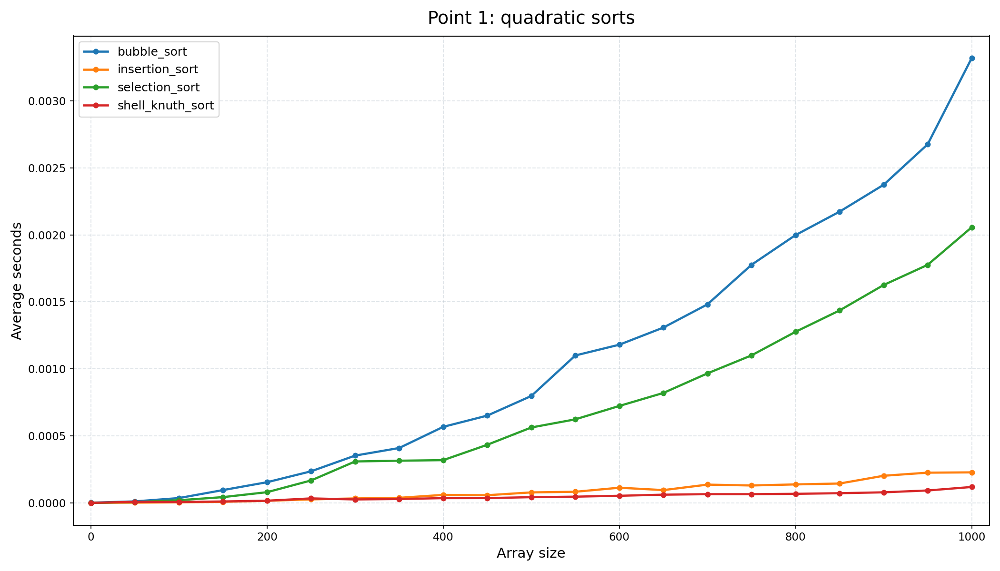

### Пункт 2. `k`-арный heapsort

Лучший результат на `n = 1000000`:

- `heap_k4_bottom_up`: `0.235687` c
- `heap_k3_bottom_up`: `0.245080` c
- `heap_k2_bottom_up`: `0.245307` c

Вывод:

- Лучшее значение получилось у `k = 4`.
- Разница между `k = 3`, `k = 4` и `k = 2` очень маленькое, что ожидаемо: уменьшение высоты кучи частично компенсируется ростом числа сравниваемых детей.


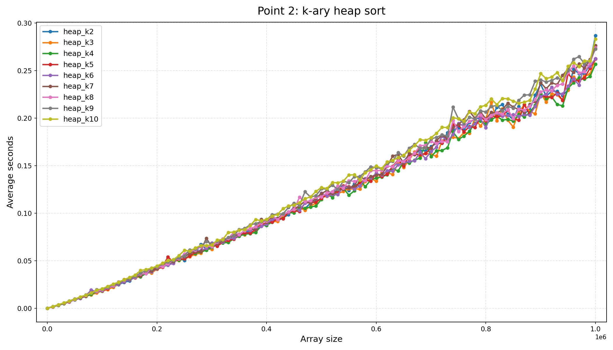

### Пункт 3. Merge sort

Лучший результат на `n = 1000000`:

- `merge_iterative_bottom_up`: `0.161716` c
- `merge_recursive_top_down` : `0.182348` c

Вывод:

- Итеративный вариант оказался примерно в `1.13x` быстрее рекурсивного.
- Это ожидаемо 3еньше накладных расходов на рекурсию и хорошая локальность доступа.

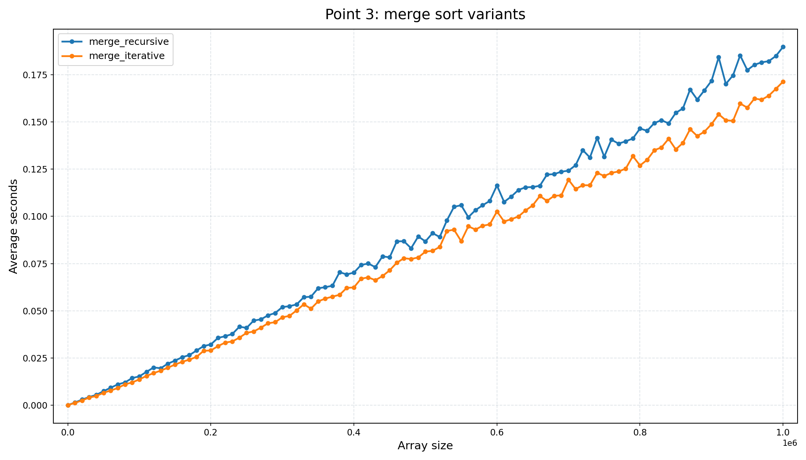

### Пункт 4. Схемы partition в quicksort

На обычных данных, `n = 1000000`:

- `quick_lomuto_partition`   : `0.147575` c
- `quick_hoare_partition`    : `0.157809` c
- `quick_three_way_partition`: `0.164219` c

На данных с большим числом повторов, `n = 1000000`:

- `quick_three_way_partition`: `0.093924` c
- `quick_hoare_partition`    : `0.111581` c
- `quick_lomuto_partition`   : `0.171765` c

Вывод:

- На случайных данных в этой реализации чуть-чуть побеждает `Lomuto`.
- На массивах с большим числом одинаковых элементов лучший результат даёт `three-way partition`.
- На duplicate-тестах `three-way` ожидаемо почти в `1.83x` быстрее `Lomuto`.

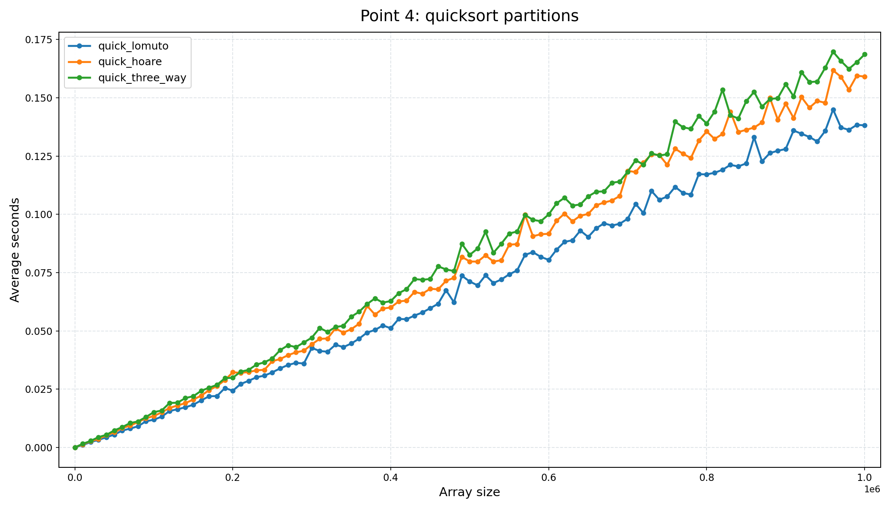

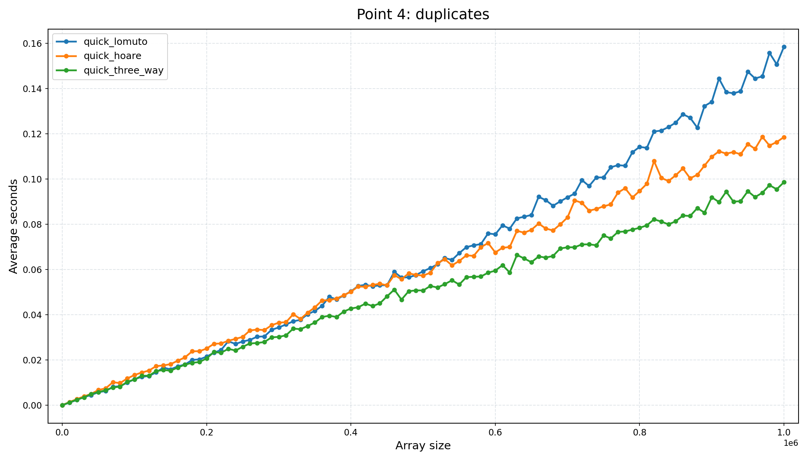

Дополнительный эксперимент по вариантам организации рекурсии:

- на обычных данных лучший `quick_median3_tailrec`: `0.087636` c;
- на duplicate-тестах различия малы, формально лучший `quick_median3_recursive`: `0.096990` c.

Вывод:

- Перевод рекурсии в tail-recursive / iterative форму даёт лишь небольшой выигрыш.
- Основной вклад в устойчивость quicksort всё равно даёт удачная схема разбиения, а не только форма рекурсии.

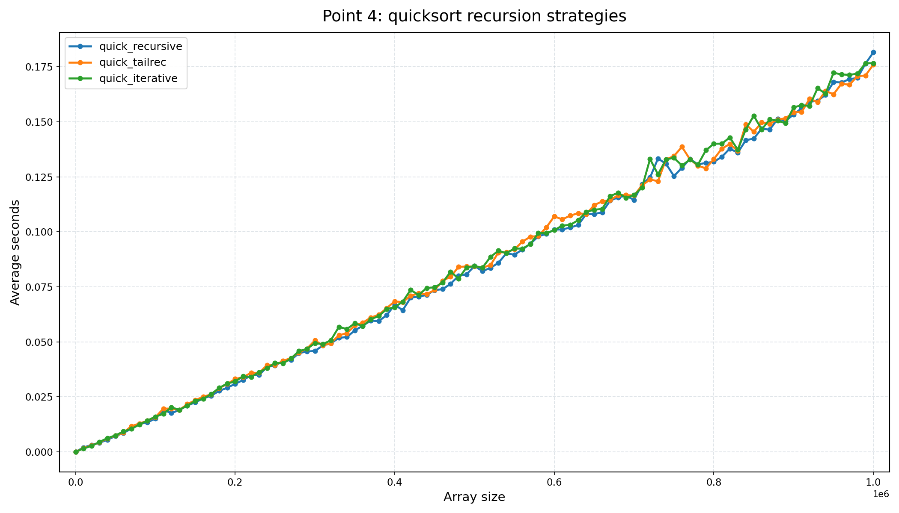

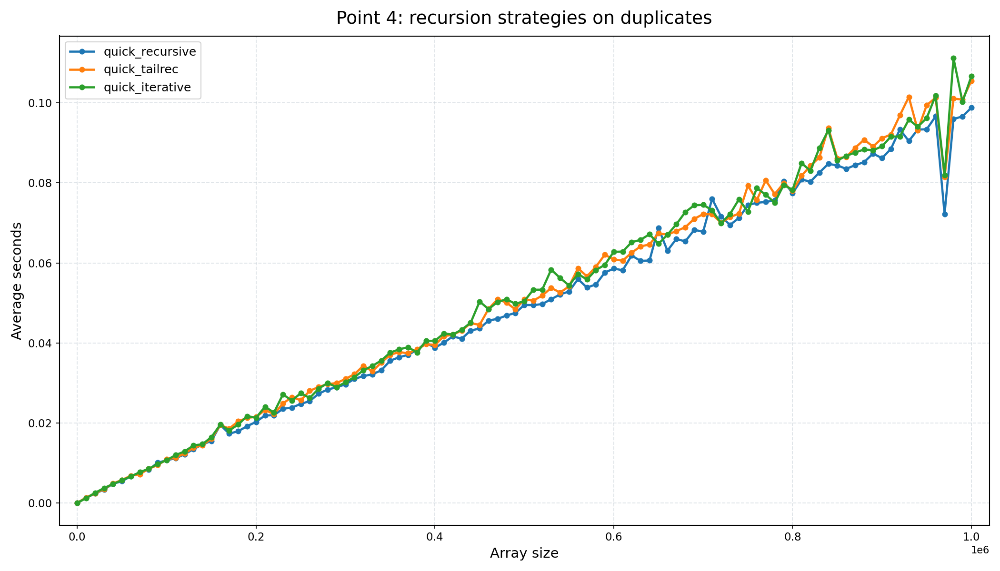

### Пункт 5. Выбор pivot

Лучший результат на `n = 1000000`:

- `quick_3way_pivot_center`: `0.166417` c
- `quick_3way_pivot_median3`: `0.166539` c
- `quick_3way_pivot_random`: `0.178756` c
- `quick_3way_pivot_median3_random`: `0.206989` c

Вывод:

- В данной серии измерений `center` и `median3` практически неотличимы.
- Чисто случайный pivot и особенно `median3_random` оказались хуже.
- Для практики разумно брать `median3`, потому что он устойчив и не требует внешней случайности.

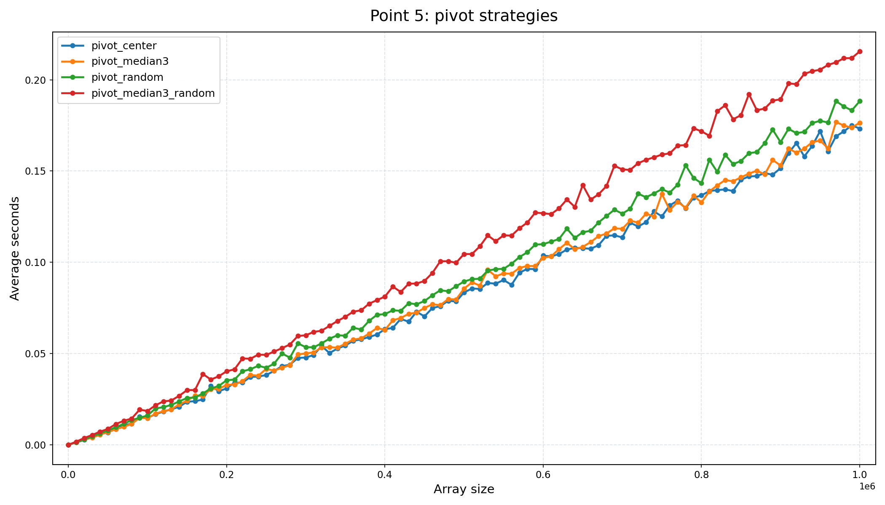

### Пункт 6. Подбор threshold для introsort

Лучший результат на `n = 1000000`:

- `introsort_threshold32`: `0.151280` c
- `introsort_threshold16`: `0.152397` c
- `introsort_threshold64`: `0.154444` c
- `quick_3way_pivot_median3_baseline`: `0.171361` c

Вывод:

- Лучший threshold в этой конфигурации: `32`.
- Различия между `16`, `32` и `64` очень маленькие.
- Даже так tuned introsort примерно в `1.13x` быстрее базового quicksort.

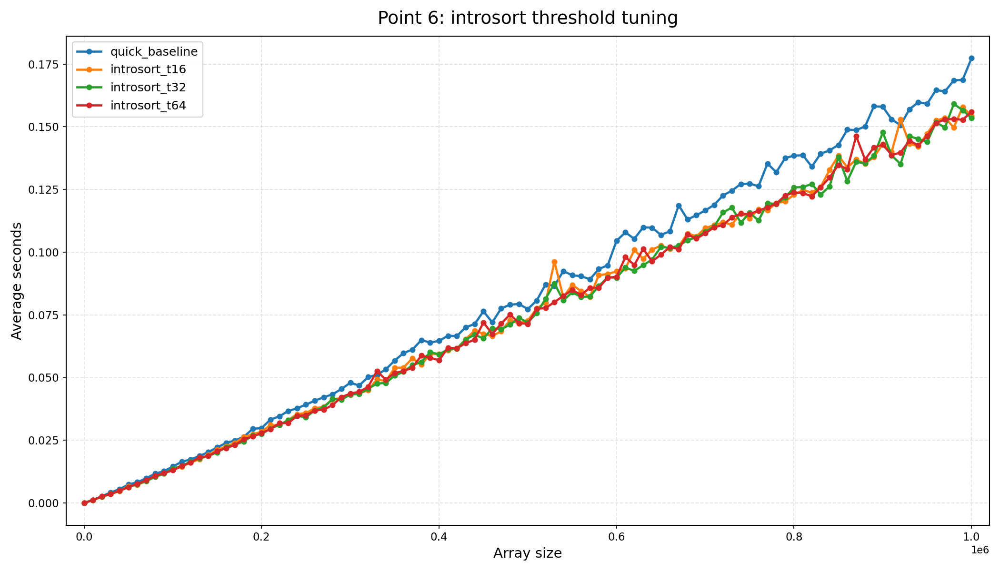

### Пункт 7. Подбор коэффициента глубины `C` для introsort

Скан коэффициента на `n = 1000000`:

- `introsort_c150`: `0.151189` c
- `introsort_c125`: `0.151314` c
- `introsort_c300`: `0.152633` c
- `introsort_c250`: `0.153401` c
- `introsort_c200`: `0.156010` c

Сравнение лучшей конфигурации с quicksort на `n = 1000000`:

- `introsort_best_config`: `0.156554` c
- `quick_3way_pivot_median3_baseline`: `0.168424` c

Вывод:

- Лучшее значение коэффициента в текущих измерениях: `C = 1.5`.
- `C = 1.25` дал почти такой же результат, то есть минимум достаточно плоский.
- Настроенный introsort стабильно лучше базового quicksort примерно в `1.08x`.

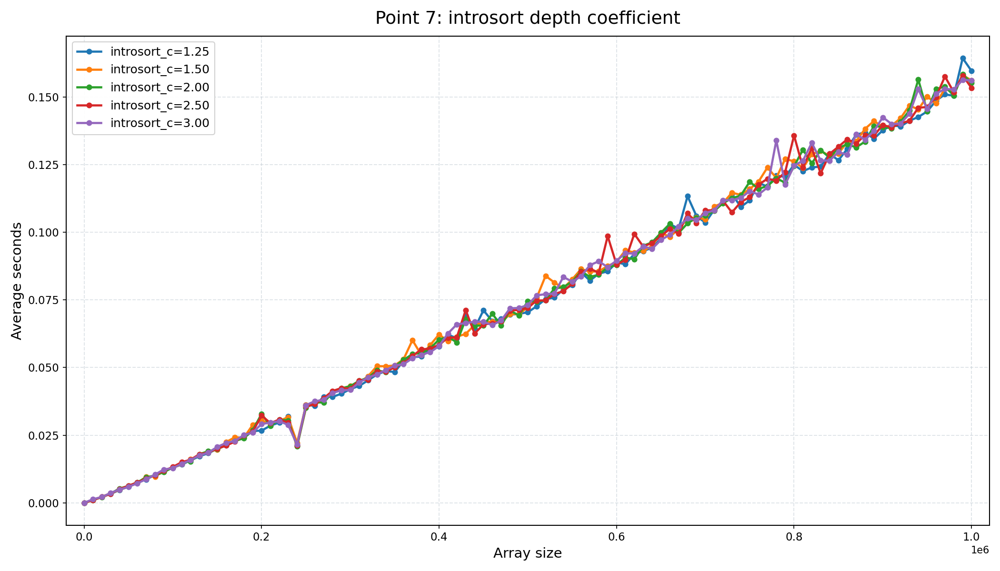

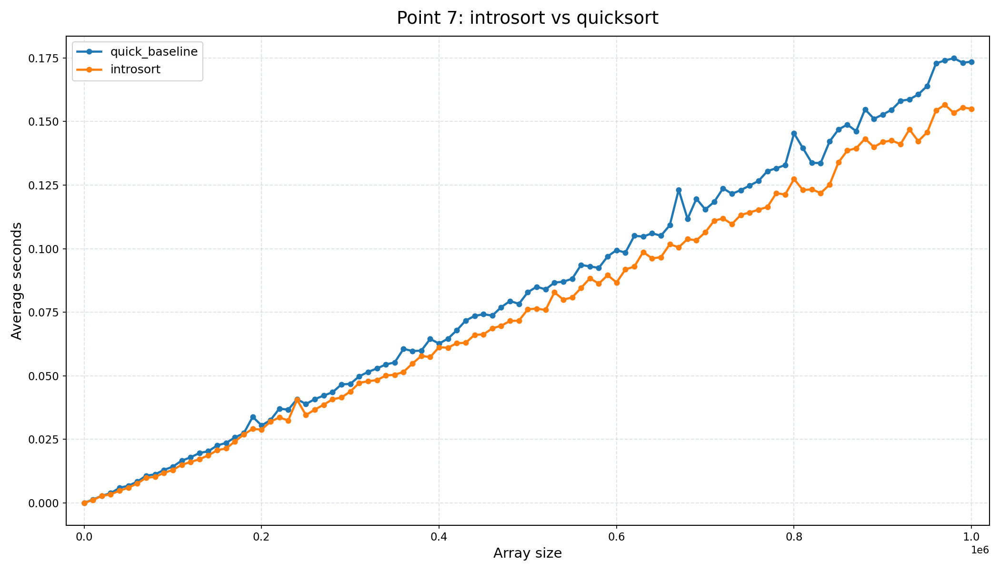

### Пункт 8. Timsort и pdqsort

Лучший результат на `n = 1000000`:

- `pdqsort_pattern_defeating`        : `0.150503` c
- `timsort_hybrid_runs`              : `0.155670` c
- `introsort_best_config`            : `0.156294` c
- `quick_3way_pivot_median3_baseline`: `0.164397` c

Вывод:

- Лучший алгоритм на сравнениях в этой работе — `pdqsort`.
- `Timsort` и `introsort` идут очень близко.
- `pdqsort` примерно в `1.09x` быстрее базового quicksort.

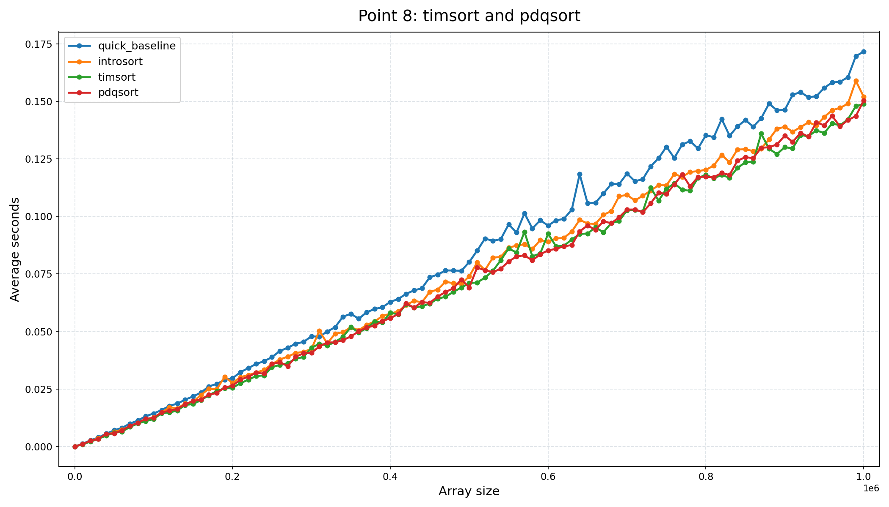

### Пункт 9. LSD и MSD radix sort

Лучший результат на `n = 1000000`:

- `radix_lsd_bytewise`: `0.011712` c
- `radix_msd_bytewise`: `0.078849` c

Вывод:

- `LSD radix sort` здесь значительно лучше `MSD radix sort`.
- Преимущество на максимальном размере составляет примерно `6.73x`.
- Для целых неотрицательных чисел фиксированной длины `LSD` оказался самым эффективным специализированным решением.

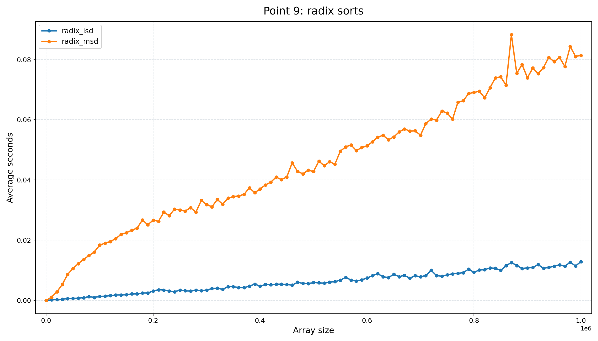

### Пункт 10. Финальное сравнение лучших алгоритмов

Лучший результат на `n = 1000000`:

- `radix_lsd_bytewise`       : `0.013760` c
- `pdqsort_pattern_defeating`: `0.146627` c
- `introsort_best_config`    : `0.149033` c
- `timsort_hybrid_runs`      : `0.157187` c
- `merge_iterative_best`     : `0.162373` c

Вывод:

- Абсолютный лидер на целых неотрицательных числах — `LSD radix sort`.
- Среди алгоритмов на сравнениях лучший результат показал `pdqsort`.
- `radix_lsd` быстрее `pdqsort` примерно в `10.66x`.
- `radix_lsd` быстрее `stdlib qsort` примерно в `17.26x`.
- `qsort` из стандартной библиотеки не является лучшим выбором для этой задачи.

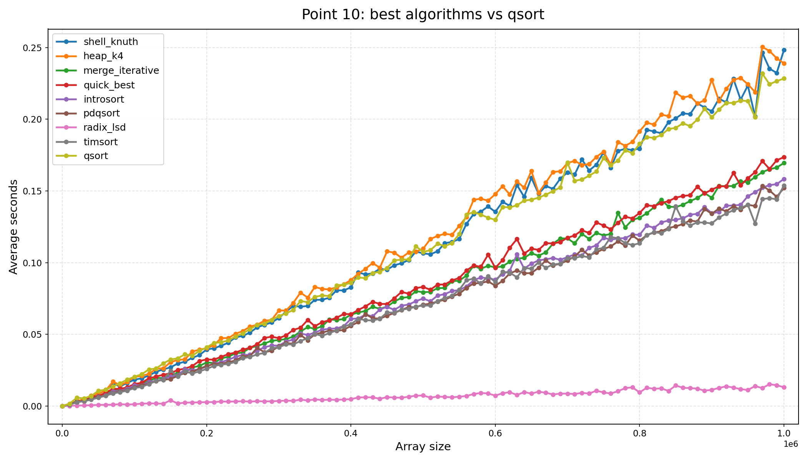

## Итоговые выводы

- Среди квадратичных сортировок лучшей оказалась `shell sort`.
- Для heapsort оптимальным значением в этой серии тестов стал `k = 4`.
- Итеративный `merge sort` лучше рекурсивного.
- Для quicksort очень важны свойства входных данных: на duplicate-массивах лучше всего работает `three-way partition`.
- Для выбора pivot хорошие результаты дают `center` и `median3`; использование случайности не помогло.
- Для introsort разумные параметры в этой работе: `threshold = 32` и `C ≈ 1.5`.
- Среди comparison-based алгоритмов лучшим оказался `pdqsort`.
- Для сортировки неотрицательных целых чисел вне конкуренции оказался `LSD radix sort`.
