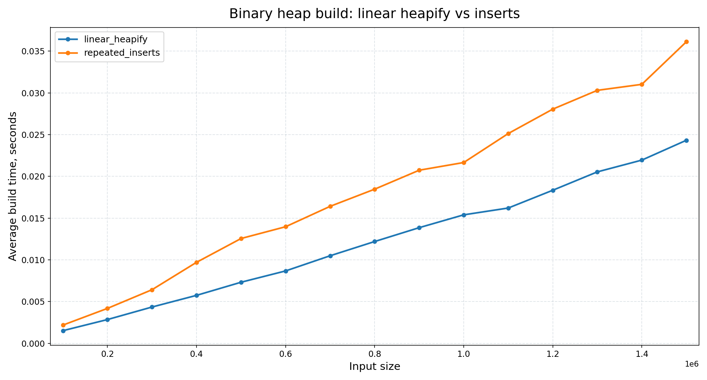
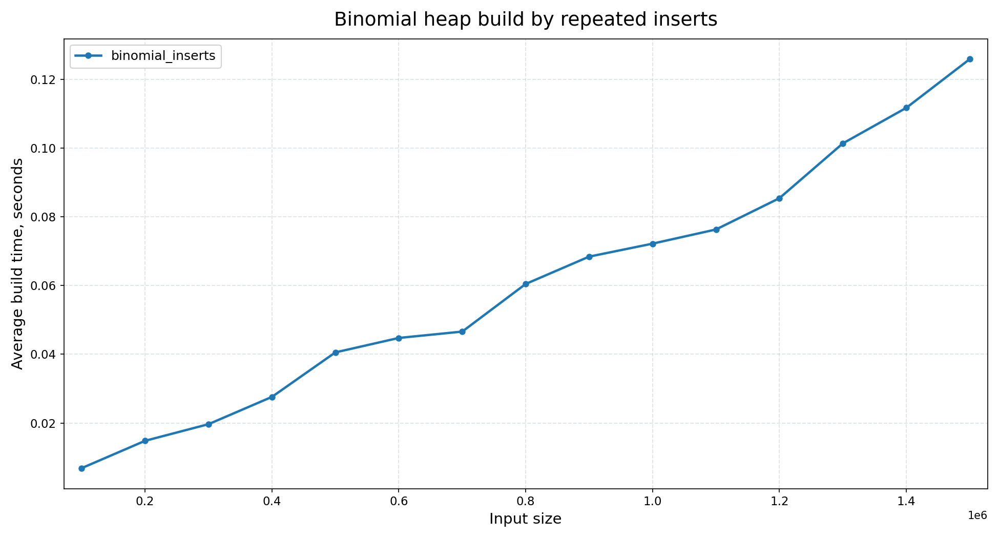
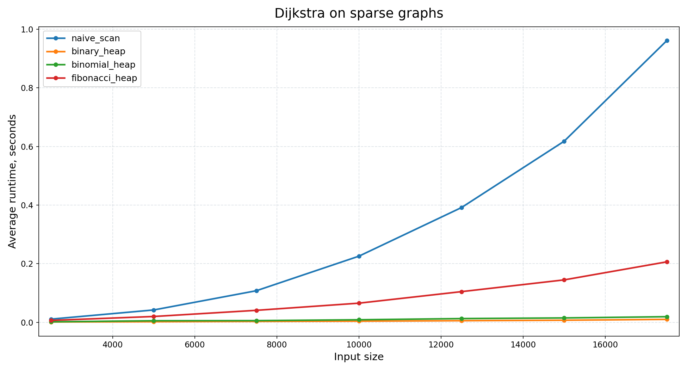
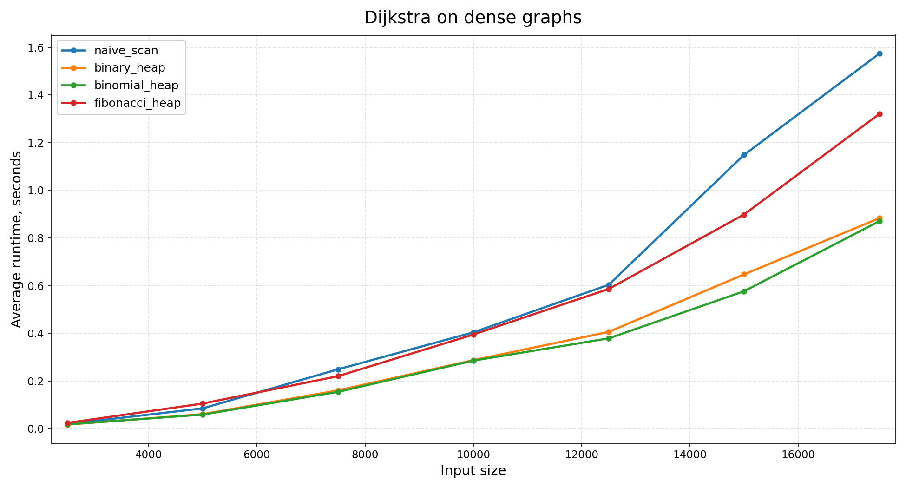

# Лабораторная работа 3. Кучи

## Структура

- `source/` — генератор тестов, `qsort`-эталон, `tester` и раннеры Дейкстры.
- `include/` — общие интерфейсы benchmark-системы и графов.
- `common/` — общие утилиты (`logger`, `asserts`, `vector`).
- `binary_heap/` — реализация бинарной кучи.
- `binomial_heap/` — реализация биномиальной.
- `fibonacci_heap/` — реализация фибоначчиевой кучи.
- `scripts/` — генерация наборов, запуск точек и построение графиков.
- `python/plot_results.py` — построение PNG-графиков по CSV.
- `results/csv/` — результаты замеров.
- `results/plots/` — графики.

## Сборка

Из корня репозитория:

```bash
make all
```

Или напрямую из папки `lab3`:

```bash
cd lab3
make all
```

Мини-проверка:

```bash
make check
```

Полный воспроизводимый прогон:

```bash
make benchmark
```


## Параметры

Пункты 1 и 2:

- benchmark использует увеличенный диапазон: от `100000` до `1500000`;
- шаг: `100000`;
- число копий на размер: `5`;
- генератор использует `seed = 42`.

Пункт 3:

- benchmark использует увеличенный диапазон: от `2500` до `17500`;
- шаг: `2500`;
- число копий на размер: `3`;
- графы генерируются в памяти с `seed = 42`;
- для `sparse` используется ориентированный связный граф с малой постоянной степенью исхода;
- для `dense` используется полный ориентированный граф без петель.

## Результаты

### Пункт 1. Бинарная куча

Файлы:

- `results/csv/point1.csv`
- `results/plots/point1.png`

На размере `n = 1500000`:

- `binary_heap_linear`: `0.024328173` с
- `binary_heap_inserts`: `0.036125230` с

Линейный `heapify` получился примерно в `1.48x` быстрее последовательных вставок.



### Пункт 2. Биномиальная куча

Файлы:

- `results/csv/point2.csv`
- `results/plots/point2.png`

На размере `n = 1500000`:

- `binomial_heap_inserts`: `0.125825444` с

По графику кривая выглядит почти линейной на выбранном диапазоне, но асимптотически построение остаётся `O(n log n)`.



### Пункт 3*. Дейкстра и фибоначчиева куча

Файлы:

- `results/csv/point3_sparse.csv`
- `results/plots/point3_sparse.png`
- `results/csv/point3_dense.csv`
- `results/plots/point3_dense.png`

На разреженных графах при `n = 17500`:

- `dijkstra_naive`: `0.960889267` с
- `dijkstra_binary_heap`: `0.010112411` с
- `dijkstra_binomial_heap`: `0.019242575` с
- `dijkstra_fibonacci_heap`: `0.206381889` с



На плотных графах при `n = 17500`:

- `dijkstra_naive`: `1.573417901` с
- `dijkstra_binary_heap`: `0.883016086` с
- `dijkstra_binomial_heap`: `0.870365137` с
- `dijkstra_fibonacci_heap`: `1.320376922` с



Выводы по звёздочному пункту:

- на `sparse` графах выигрыш бинарной кучи над наивной версией на `n = 17500` получился примерно `95.0x`;
- биномиальная куча на `sparse` выигрывает у наивного варианта, но уступает бинарной из-за больших констант;
- фибоначчиева куча в этой реализации не обогнала бинарную и биномиальную;
- на `dense` графах различия между бинарной и биномиальной оказались очень малыми, около `1.01x`;
- на `dense` при `n = 17500` биномиальная куча оказалась чуть быстрее бинарной, но разница близка к шуму измерений.

## Итог

- линейное построение бинарной кучи существенно лучше последовательных вставок;
- биномиальная куча строится сильно медленнее бинарной линейной heapify;
- для Дейкстры на разреженных графах самая быстрая реализация — бинарная куча;
- для Дейкстры на плотных графах бинарная и биномиальная кучи идут почти одинаково, с небольшим преимуществом биномиальной на максимальном размере;
- фибоначчиева куча проигрывает (вероятно из-за высоких констант);
